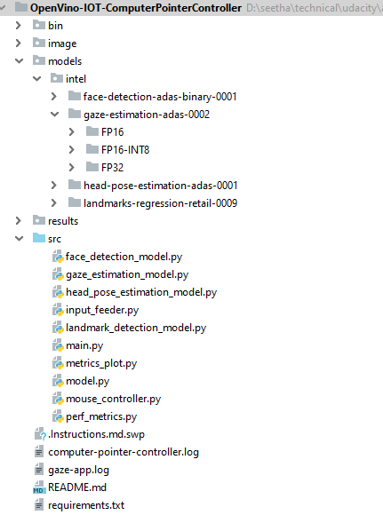

# Computer Pointer Controller

Computer Pointer Controller application controls the mouse pointer through user's eyes.  
[Gaze Estimation Model](https://docs.openvinotoolkit.org/latest/_models_intel_gaze_estimation_adas_0002_description_gaze_estimation_adas_0002.html) to estimate the gaze of the user's eyes and change the mouse pointer position accordingly


**Data Flow looks like this**  


 * [Face Detection](https://docs.openvinotoolkit.org/2020.3/_models_intel_face_detection_adas_binary_0001_description_face_detection_adas_binary_0001.html)
 * [Facial Landmark Detection](https://docs.openvinotoolkit.org/2018_R5/_docs_Retail_object_attributes_landmarks_regression_0009_onnx_desc_landmarks_regression_retail_0009.html)
 * [Head Position Estimation](https://docs.openvinotoolkit.org/2020.3/_models_intel_head_pose_estimation_adas_0001_description_head_pose_estimation_adas_0001.html)
 * [Gaze Estimation Model](https://docs.openvinotoolkit.org/2020.3/_models_intel_gaze_estimation_adas_0002_description_gaze_estimation_adas_0002.html)
 
## Project Set Up and Installation

|       Spec      |       Detail       |
|-----------------------|---------------|
| Programming Language |  Python 3.7 |
| OpenVino | openvino_2020.3.194 |
| Models Required |face-detection-adas-binary-0001   <br /><br />landmarks-regression-retail-0009 <br /><br /> head-pose-estimation-adas-0001 <br /><br />gaze-estimation-adas-0002|
| Operating System |  Windows 10|
| Processor |  Intel(R) Core(TM) i7-8550U CPU @ 1.80GHz|


**1. Setup OpenVINO Toolkit in local**  
   * [Install OpenVINO Toolkit](https://docs.openvinotoolkit.org/latest/_docs_install_guides_installing_openvino_windows.html)
   * [Install Visual Studio 2019](https://visualstudio.microsoft.com/downloads/)
   * [Install Anaconda3](https://docs.anaconda.com/anaconda/install/windows/)  
   (ensure all environment variables)
   
**2. Create Conda Environment**  
Go to application root directory
```
conda create -y --name computer-pointer python==3.7
conda install --force-reinstall -y -q --name computer-pointer -c conda-forge --file requirements.txt
activate computer-pointer
```

**3. Set OpenVINO Environment Variables**  
```
set OPENVINO_HOME=D:\work\install\IntelSWTools\openvino_2020.3.194
echo %OPENVINO_HOME%

%OPENVINO_HOME%\bin\setupvars.bat
echo %PYTHONPATH%
```

**4. Download Models**  
  * Ensure to install python packages required for Download
  ```
pip install -r %OPENVINO_HOME%\deployment_tools\open_model_zoo\tools\downloader\requirements.in
```
  * Download Models
  ```
  python %OPENVINO_HOME%\deployment_tools\tools\model_downloader/downloader.py --name face-detection-adas-binary-0001 -o models/
python %OPENVINO_HOME%\deployment_tools\tools\model_downloader/downloader.py --name landmarks-regression-retail-0009 -o models/

python %OPENVINO_HOME%\deployment_tools\tools\model_downloader/downloader.py --name head-pose-estimation-adas-0001 -o models/
python %OPENVINO_HOME%\deployment_tools\tools\model_downloader/downloader.py --name gaze-estimation-adas-0002 -o models/
  ```

**5. Folder Structure**  



## Demo

* Application options
```
python src\main.py --help 

Usage: main.py [OPTIONS]

Options:  
  -fdm, --fdmodel TEXT            Face Detection Model  
  -ldm, --ldmodel TEXT            Landmark Detection Model  
  -hpem, --hpemodel TEXT          Head Pose Estimation Model  
  -gem, --gemodel TEXT            Gaze Estimation Model  
  -d, --device [CPU|GPU|MYRIAD|FPGA] Device  
  -pr, --precision TEXT           model precision  
  -ext, --extension TEXT          Extensions  
  -p, --prob_threshold FLOAT      Probability Threshold  
  -c, --is_cam                    Enable camera for input  
  -i, --input PATH                Input File path  
  -v, --is_visual                 Draw intermediate result and make more
                                  visual or not  

  -mp, --is_move_pointer          Move mouse pointer or not  
  -sf, --is_show_frame            Show frame or not  
  --help                          Show this message and exit  
```

* Run Application

Note: OpenVINO in Windows 10 is not supported MP4 video format. Converted windows compatiable format - AVC

**FP32**
```
python src\main.py -fdm models\intel\face-detection-adas-binary-0001\FP32-INT1\face-detection-adas-binary-0001 -ldm models\intel\landmarks-regression-retail-0009\FP32\landmarks-regression-retail-0009 -hpem models\intel\head-pose-estimation-adas-0001\FP32\head-pose-estimation-adas-0001 -gem models\intel\gaze-estimation-adas-0002\FP32\gaze-estimation-adas-0002 -i bin\demo.avchd.mts -d CPU -pr FP32 -v -sf -mp
```

**FP16**
```
python src\main.py -fdm models\intel\face-detection-adas-binary-0001\FP32-INT1\face-detection-adas-binary-0001 -ldm models\intel\landmarks-regression-retail-0009\FP16\landmarks-regression-retail-0009 -hpem models\intel\head-pose-estimation-adas-0001\FP16\head-pose-estimation-adas-0001 -gem models\intel\gaze-estimation-adas-0002\FP16\gaze-estimation-adas-0002 -i bin\demo.avchd.mts -d CPU -pr FP16 -v -sf -mp
```

**INT8**
```
python src\main.py -fdm models\intel\face-detection-adas-binary-0001\FP32-INT1\face-detection-adas-binary-0001 -ldm models\intel\landmarks-regression-retail-0009\FP16-Int8\landmarks-regression-retail-0009 -hpem models\intel\head-pose-estimation-adas-0001\FP16-Int8\head-pose-estimation-adas-0001 -gem models\intel\gaze-estimation-adas-0002\FP16-Int8\gaze-estimation-adas-0002 -i bin\demo.avchd.mts -d CPU -pr INT8 -v -sf -mp
```

## Benchmarks

* Model Loading Time  


* Model Inference Time


## Results

Benchmarks shows INT8 relativley takes less inference time compare to FP32, FP16. But FP32 acurracy better than INT8  
Inference time performance order: INT8 -> FP16 -> FP32  
Accuracy order: FP32 -> FP16 -> INT8.   
Because INT8 has low precision weights, which increase inference performance and degrade accuracy. whereas FP32 has high precision weights, which boost accuracy. 
